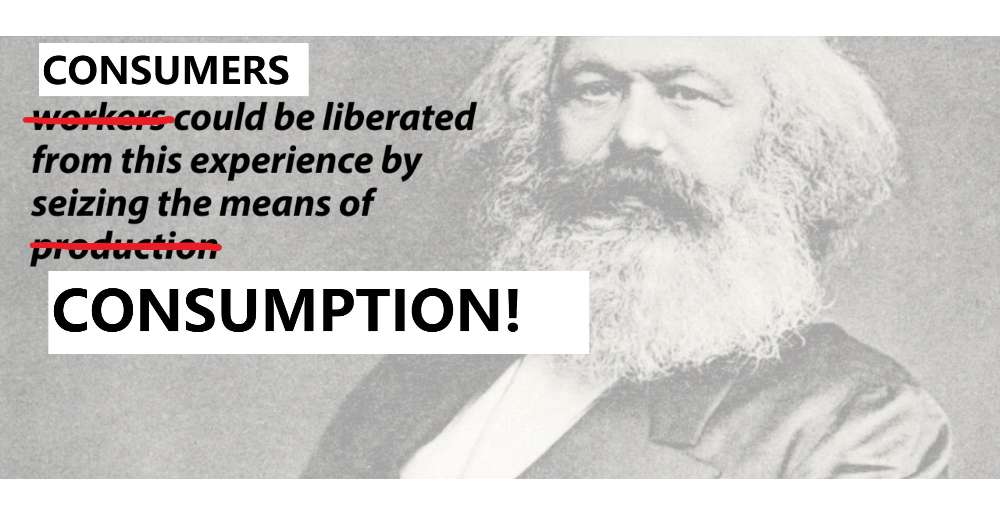
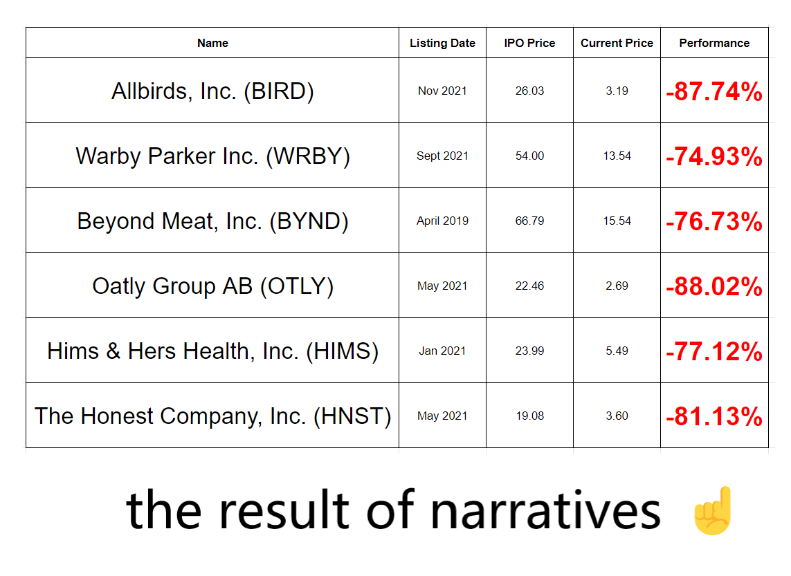
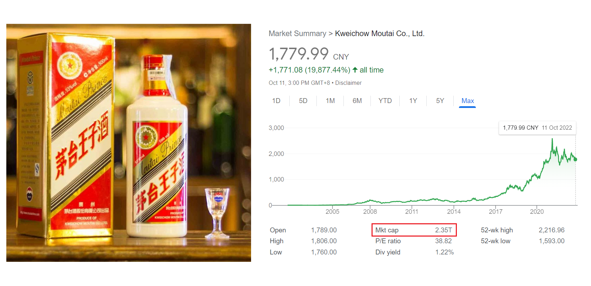

# Algebra Smart Contracts -- reimagining the commerce of everyday products

This is Version 0.2 of the Algebra Smart Contracts, exploring new and more efficient ways to buy and sell everyday products by re-aligning incentives using blockchain technology.

Many thanks to OpenZepellin.

## Foreword

First and foremost, it is the consumer and their act of consuming which legitimizes any given item’s status as a “product”. As such, we structure incentives for the consumer, not only to buy, but more importantly to also buy again; and even more valuable, to promote the product. We do this by issuing utility or governance tokens to the consumer for every purchase they make in order to give them some “skin in the game”.

  

  

Next, by providing on-chain representations of products, we enable transactions for products to be executed on-chain and bring trustless transparency to transaction data and therefore to sales performance.

  

  

In an environment where sales performance is transparent and open, merchants are incentivized to build products that the market actually wants rather than to build narratives that sound good to VCs. The market experienced this with the slew of consumer brands IPOs in the past three years, when the actual sales performance for many of the brands with the hottest narratives finally became public, and the reveal of their dismal performance consequently led to tens of billions of dollars in investor value being completely wiped out.

  

  

It turns out that the capital market is more interested in actual sales performance than in narratives; and it turns out the consumer market was not actually interested in the products created under supposedly popular narratives. Total catastrophe, with tens of billions of dollars and tens of millions of labor hours misallocated and wasted.

It is in the interest of the investor to invest into products that the market actually wants. It is in the interest of the merchant to have the capital necessary to build the best products possible. It is in the interest of the market to have the best products possible. These interests are aligned when we bring transparency to sales performance. We see this in action with publicly listed companies and with blockchain adoption we can bring this dynamic to early stage consumer companies too.

  

  

Although there may be some perception that such a transparent environment is too tough for many merchants, if transparent sales performance can lead to decentralized fundraising, then merchants confident in the products they bring to the market are incentivized to participate. This is, after all, how publicly traded companies operate.

The ultimate goal is to use blockchain technology to align incentives under a framework which makes the buying and selling of consumer goods as efficient as possible; to bring the best possible products to the market; to avoid misallocation of capital; and to maximize the potential contribution of the consumer.

There are four smart contracts in the Algebra framework and they are described as follows:

## BranchSBT.sol – representing the product on the blockchain

**BranchSBT.sol is the smart contract which provides on-chain representation for the product; to purchase one unit of the product, the consumer mints one soul-bound token (“SBT”) from this contract.**

The product, as the core unit of commerce, needs representation on the blockchain. Without having on-chain representation of a given product, we have no means to utilize blockchain functionalities to the commerce of said product; we cannot determine who is the merchant and who is the consumer; we have no means to seamlessly determine when the product is sold or how much of the product is sold; etc.

In commerce today, the barcode provides representation for the product to be recognized by point-of-sale devices, warehouses, and e-commerce data servers. We can recreate what the barcode accomplishes on the blockchain with a BranchSBT smart contract.

  

  

Each product is injectively tied to a BranchSBT contract. Any time a consumer wants to purchase the product they mint an SBT from the product’s BranchSBT contract. One SBT represents one unit of the product and undergoes a claim process whenever the consumer wants to receive the physical version of the product.

Why SBTs? Why not NFTs?

Because everyday consumer products are not bought to be traded or collected; they are bought to be used. Although tradable products are valuable, we want to focus on building a framework for consumption and including a speculative element can be distracting to this purpose.

In addition to acting as the on-chain representative for one unit of the product, the SBT also remains in the wallet of the consumer as a receipt of their purchase.

## $SBT.sol – giving the consumer “skin in the game”

**$SBT.sol is the smart contract which the consumer (the SBT holder) interacts with when they claim the physical version of the product. The claim process issues $SBT ERC-20 tokens to the consumer and is limited to one initiation for each SBT.**

Before jumping into technical details, let’s take a brief look at the consumer goods market.

The most valuable consumer goods company in the world is Kweichow Moutai (SHA: 600519) with a ~2.4T RMB market cap, equivalent to roughly 340M USD, and 10% higher than LVMH (EPA: MC).

  

  

Why?

The retail investor, to whom Moutai has social value, wants a piece of the action; perhaps they cannot afford a bottle of real Moutai, but they nonetheless want “skin the game” and therefore buy the stock. In addition to “believing in the company” and therefore capturing potential financial upside, the retail investor is able to generate the same internal validation that comes from buying a Moutai product. Instead of being able to self-identify as “the person who buys Moutai”, they can self-identify as “the person who owns a piece of Moutai”. Close enough, or maybe even better?

  

  

A tremendous driver for the consumption of consumer goods is the sense of identity that the consumer derives from their purchase. This is not limited to luxury goods; we also see this in basic food choices, for example in the identities that are built around one’s aversion to meat or, on the other side, to “fake” meat.

If so, why not further tap into this sentiment by giving consumers of a given product more “skin in the game” by issuing utility or governance tokens each time they purchase the product? An example of utility could be a structure where limited editions of the product can only be purchased in these tokens. The governance angle, more interesting to us, would mean that the consumers have varying degrees of actual input into the direction of the product, perhaps voting on new colors, flavors, or collaborations.

  

  

The “community-driven” model is “definitely something”. It creates a framework where the consumer continues to go back to the merchant, to buy the product again and again, and even bring in new members. We see this with brands like Nike and Lululemon, but these community bonds are rarely tangible and often limited to each brand’s exclusive locale of loyalty points.

By introducing blockchain functionality such that every purchase comes with a governance token, we make the community bonds built around a product more tangible and actionable. Furthermore, the community is brought to light before the entire blockchain ecosystem, allowing for potentially exponential growth. This is the shift from limited ecosystems, like the digital-gold-to-fiat system from World of Warcraft, to the much greater open-source blockchain market, such as with SLP/AXS from Axie Infinity; the trading volumes, rate of growth, and total impact is immeasurably greater in the latter case.

As for technical specifics, $SBT.sol is tied to the claim process and this means that only those who have SBTs in their wallet can interact with it successfully. Since each SBT can only be used to initiate one claim, this means that the wallet owner needs to hold unclaimed SBTs in their wallet in order to complete a claim and receive tokens from $SBT.sol.

  

  

The exact specifications for what kind of token is issued by $SBT.sol whenever a product is claimed can be determined by the merchant.

The core idea here is that giving the consumer “skin in the game” can unlock tremendous growth and open new network effects to the world of consumer goods. As mentioned, for any given product, the consumer is the ultimate driver for the success of the product and we want to align the consumer’s incentives towards the long-term success of the product.

## TrunkNFT.sol – owning the product on-chain

**TrunkNFT.sol is the smart contract which issues NFTs that represent an ownership position of the product.**

Instead of using ERC-20 tokens to mimic equity ownership, we use NFTs to resemble something closer to a Board of Directors, where each holder has a certain degree of responsibility and can also memetically display their ownership if they choose to do so. Like any other ownership position, the NFT can be subject to speculation and can be bought and sold.

  

  

An NFT ownership structure is not intended to replace the governance token system and does not preclude the possibility of also issuing ERC-20 tokens to represent ownership, or "governance" (can be the $SBT token, for example). Rather, our purpose here is to make each ownership position more identifiable and therefore introduce greater responsibility. This is why the mechanism of the Board of Directors was introduced to corporate structures in the first place, and for the most part the structure has been helpful in delivering positive results.

How each ownership position is attained can be determined on a case-by-case basis by the relevant parties; perhaps free mints can be given to operators while a certain price is set for early investors. However, the TrunkNFT.sol requires that a hard cap to the number of ownership NFTs be determined for deployment. Further, TrunkNFT.sol places no limitation on how many of the limited NFTs can be held by a single wallet.

## Payment.sol and Payment_Account.sol - trustless paymasters splitting up proceeds

**Payment.sol and its variant Payment_Account.sol are the smart contracts which hold the proceeds from sales of the product (SBT mints from BranchSBT.sol) and split them amongst the product owners (holders of NFTs issued by TrunkNFT.sol).**

Beyond memetic displays and actual responsibilities, ownership needs to have its benefits. The most obvious benefit is the right to dividends. Under traditional structures, even at the best companies, there is always a certain degree of friction and opacity when it comes to dividend payouts. The introduction of the trustless paymaster for dividend payouts, made possible by blockchain technology, is a beautiful innovation that allows ownership to be more actionable and tangible.

Our Payment contracts are unique modifications of PaymentSplitter.sol by OpenZepellin, which splits the cryptocurrency deposited into the contract between different parties at set rates. The original contract requires the deployer to firmly set the addresses of these parties and the rates for how the proceeds should be divided in order to deploy the contract. This does not work for our purposes and was therefore accordingly modified.

Under our framework, the funds due and the ability to withdraw those funds are tied to the NFTs minted from the TrunkNFT smart contract. Each NFT is due an equal portion of the proceeds; for example, if there are 10 NFTs minted from TrunkNFT, then each NFT is due 1/10th of the proceeds.

  

  

Payment.sol ties the payout to the specific Token ID of the NFT. The party seeking a payout will input a Token ID and will need to hold the corresponding NFT to successfully withdraw the funds due to that Token ID.

Payment_Account.sol ties the payout to the wallet address of the executing party, determining whether or not the wallet holds the appropriate NFTs and then sending the corresponding amount of funds to the wallet. For example, if the wallet holds 2 of the 10 NFTs, then the wallet will receive 2/10 of the total amount received by the contract.

The Payment contracts can also be used to payout commissions for influencers or affiliates who help sell the product. The whole Algebra framework for transparent access to sales data and provides a trustless means for these collaborators to pull their share of the proceeds. This enables parties to work together without having to worry about whether or not the counterparty will fail to pay them.

  

  

## How the Smart Contracts Interact

The smart contracts are to be deployed in this order:

  -- TrunkNFT.sol

  -- Payment.sol (requires address of deployed TrunkNFT.sol)

  -- BranchSBT.sol (requires address of deployed TrunkNFT.sol and address of deployed Payment.sol)

  -- $SBT.sol (requires address of deployed TrunkNFT.sol and address of deployed BranchSBT.sol)
  
TrunkNFT.sol determines who owns the product and therefore who can successfully interact with Payment.sol. The product owners are also the Owners of the contracts deployed from BranchSBT.sol, Payment.sol, and $SBT.sol.

Payment.sol divides the proceeds from sales of the product and therefore will be designated as the contract where proceeds from mints from BranchSBT.sol are pushed into.

BranchSBT.sol represents the product and therefore will be designated as the address which identifies which SBTs are eligible to claim from $SBT.sol. Only holders of TrunkNFTs will be able to push the proceeds gathered from mints of BranchSBT.sol to Payment.sol.

$SBT.sol is used in the claim process to issue utility or governance tokens to the consumer for each purchase made (each mint from BranchSBT.sol). No funds are collected in $SBT.sol.

## Conclusion

Thank you for reading. There were many parties that helped with this process and we especially give a shout out to aeto for guiding us through this process.

Collectively, we have produced many consumer products, including both successful and unsuccessful products. In this process, the two most important things we have learned are (i) how valuable the consumer is and (ii) how misguided common narratives are.

We are excited at the prospect of introducing functionalities made possible only by blockchain technology to the consumer space. The smart contracts will certainly need to be improved and audited, but provide a working version of the framework necessary to build the first Web3 consumer product and brand.

We will be the first ones to utilize this framework and gladly invite others to adopt and improve on it as well.

  

  
